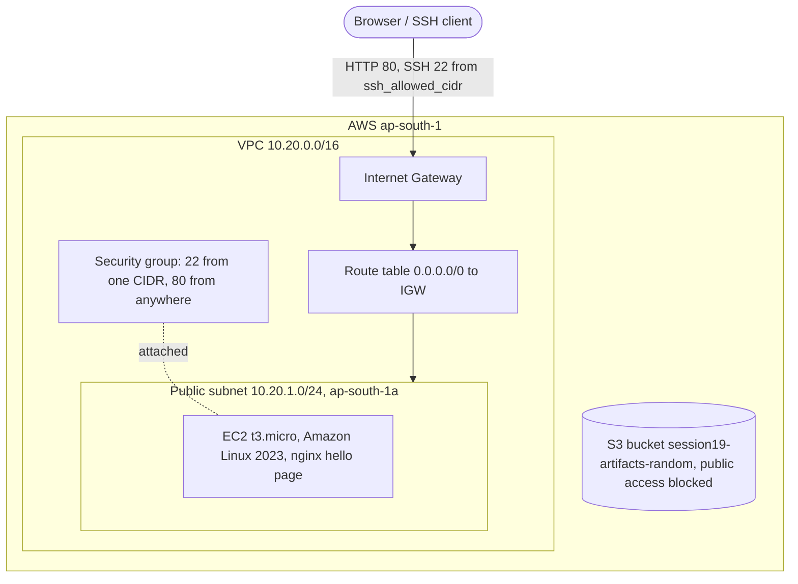

# Cloud & Terraform Homework — Session 19

Bibek Jyoti Charah — 24bcs10112 (GitHub: SammyUrfen)

Environment: Fedora 44, Terraform v1.16.1, AWS provider v6.67.0, random provider v3.9.1. No Kubernetes cluster is used.
There are **no AWS credentials on this machine yet**, so only the commands that do not call AWS ran
(`version`, `init`, `fmt`, `validate`, `graph`). Their output is pasted as printed; long output is cut with `...`.
`plan`, `apply`, `state list` and `destroy` are marked **Pending** below with the exact commands to run.

## Architecture



## Files

| File | Contents |
|---|---|
| `provider.tf` | Terraform version, `aws` and `random` providers, region, default tags |
| `variables.tf` | Region, name prefix, CIDRs, instance type, SSH CIDR (validated), optional key pair |
| `main.tf` | VPC, subnet, IGW, route table + association, security group, AMI data source, EC2, S3 |
| `outputs.tf` | IDs, AMI, public IP, web URL, bucket name |
| `terraform.tfvars.example` | Sample values. Copy to `terraform.tfvars` (git-ignored) |

## Concepts

- **Providers.** A provider is a plugin that turns Terraform resources into API calls. `hashicorp/aws` talks to AWS.
  `hashicorp/random` makes a random suffix for the S3 bucket name, because bucket names are global.
  `init` downloads them and pins the versions in `.terraform.lock.hcl` (committed).
- **Variables.** Inputs in `variables.tf`. Region defaults to `ap-south-1`. `ssh_allowed_cidr` has no default,
  so you must set it. A validation block rejects `0.0.0.0/0` so SSH is never open to the world.
- **Resources.** Each `resource` block is one AWS object. `data "aws_ami"` is a read-only lookup: it finds the
  latest Amazon Linux 2023 AMI at plan time, so no region-specific AMI ID is hard-coded.
  `user_data` installs nginx on first boot and writes a hello page.
- **Outputs.** Values printed after `apply` (and by `terraform output`), for example the URL of the hello page.
- **Dependencies.** Terraform builds a graph and creates resources in order.
  - *Implicit:* a reference such as `vpc_id = aws_vpc.main.id` makes the subnet wait for the VPC. Most edges in the graph come from references.
  - *Explicit:* `aws_instance.web` has `depends_on = [aws_route_table_association.public]`. The instance block does not
    reference the route table, so without this Terraform could boot the instance before the subnet has an internet route.
    Then `dnf install nginx` in `user_data` fails and the page never appears.
  - `destroy` walks the same graph in reverse.
- **State.** After `apply`, Terraform writes `terraform.tfstate`: the map from each resource address to the real AWS ID.
  `plan` compares config, state and real AWS to find the changes. State can hold sensitive values, so `*.tfstate*`
  is git-ignored. A team would use a remote backend (S3 + locking); this homework keeps local state.

## Cost

All resources are free-tier or free: t3.micro (free-tier eligible in ap-south-1), VPC/subnet/IGW/route table/security
group (no charge), an empty S3 bucket. The public IPv4 address on the instance is billed hourly by AWS (about
USD 0.005/h) outside the free-tier allowance. No NAT gateway, no Elastic IP. **Run `terraform destroy` as soon as you
have checked the page.** `force_destroy = true` on the bucket lets destroy delete it even if it holds objects.

## Commands that ran (no AWS needed)

```
$ terraform version
Terraform v1.16.1
on linux_amd64

Your version of Terraform is out of date! The latest version
is 1.16.5. You can update by downloading from https://developer.hashicorp.com/terraform/install
```

```
$ terraform init
Initializing the backend...

Initializing provider plugins...
- Finding hashicorp/aws versions matching "~> 6.0"...
- Finding hashicorp/random versions matching "~> 3.6"...
- Installing hashicorp/aws v6.67.0...
- Installed hashicorp/aws v6.67.0 (signed by HashiCorp)
- Installing hashicorp/random v3.9.1...
- Installed hashicorp/random v3.9.1 (signed by HashiCorp)

Terraform has created a lock file .terraform.lock.hcl to record the provider
selections it made above. Include this file in your version control repository
so that Terraform can guarantee to make the same selections by default when
you run "terraform init" in the future.

Terraform has been successfully initialized!
...
```

```
$ terraform fmt -recursive
$ echo $?
0
```

(`fmt` printed no file names, so all files were already formatted.)

```
$ terraform validate
Success! The configuration is valid.
```

```
$ terraform graph
digraph G {
  rankdir = "RL";
  node [shape = rect, fontname = "sans-serif"];
  "data.aws_ami.al2023" [label="data.aws_ami.al2023"];
  "aws_instance.web" [label="aws_instance.web"];
  "aws_internet_gateway.main" [label="aws_internet_gateway.main"];
  "aws_route_table.public" [label="aws_route_table.public"];
  "aws_route_table_association.public" [label="aws_route_table_association.public"];
  "aws_s3_bucket.artifacts" [label="aws_s3_bucket.artifacts"];
  "aws_s3_bucket_public_access_block.artifacts" [label="aws_s3_bucket_public_access_block.artifacts"];
  "aws_security_group.web" [label="aws_security_group.web"];
  "aws_subnet.public" [label="aws_subnet.public"];
  "aws_vpc.main" [label="aws_vpc.main"];
  "random_id.bucket_suffix" [label="random_id.bucket_suffix"];
  "aws_instance.web" -> "data.aws_ami.al2023";
  "aws_instance.web" -> "aws_route_table_association.public";
  "aws_instance.web" -> "aws_security_group.web";
  "aws_internet_gateway.main" -> "aws_vpc.main";
  "aws_route_table.public" -> "aws_internet_gateway.main";
  "aws_route_table_association.public" -> "aws_route_table.public";
  "aws_route_table_association.public" -> "aws_subnet.public";
  "aws_s3_bucket.artifacts" -> "random_id.bucket_suffix";
  "aws_s3_bucket_public_access_block.artifacts" -> "aws_s3_bucket.artifacts";
  "aws_security_group.web" -> "aws_vpc.main";
  "aws_subnet.public" -> "aws_vpc.main";
}
```

Read an edge `A -> B` as "A depends on B". The edge `aws_instance.web -> aws_route_table_association.public`
is the explicit `depends_on`; the others come from references.

## Pending: run after AWS credentials are configured

These commands call AWS. They have **not** run yet; no output is shown on purpose.

```
terraform plan -out=tfplan
terraform apply tfplan
terraform output
terraform state list
curl $(terraform output -raw web_url)
terraform destroy
```

Expected: `plan` shows 10 resources to add (VPC, subnet, IGW, route table, association, security group, instance,
random_id, bucket, public access block). `state list` shows those plus `data.aws_ami.al2023`.

## How to run once AWS is ready

1. Install the AWS CLI and run `aws configure` (access key of an IAM user, region `ap-south-1`). Check with `aws sts get-caller-identity`.
2. `cp terraform.tfvars.example terraform.tfvars` and set `ssh_allowed_cidr` to your IP: `echo "$(curl -s https://checkip.amazonaws.com)/32"`.
   Set `key_name` only if you made a key pair and want SSH.
3. `terraform init`, then `terraform plan -out=tfplan`, then `terraform apply tfplan`.
4. Wait 1–2 minutes for `user_data`, then open the `web_url` output. It should show "Hello from session19".
5. `terraform state list` to see what Terraform tracks.
6. **`terraform destroy`** and type `yes`. Check the EC2 console shows the instance as terminated.
7. Paste each output into the Pending section above.
